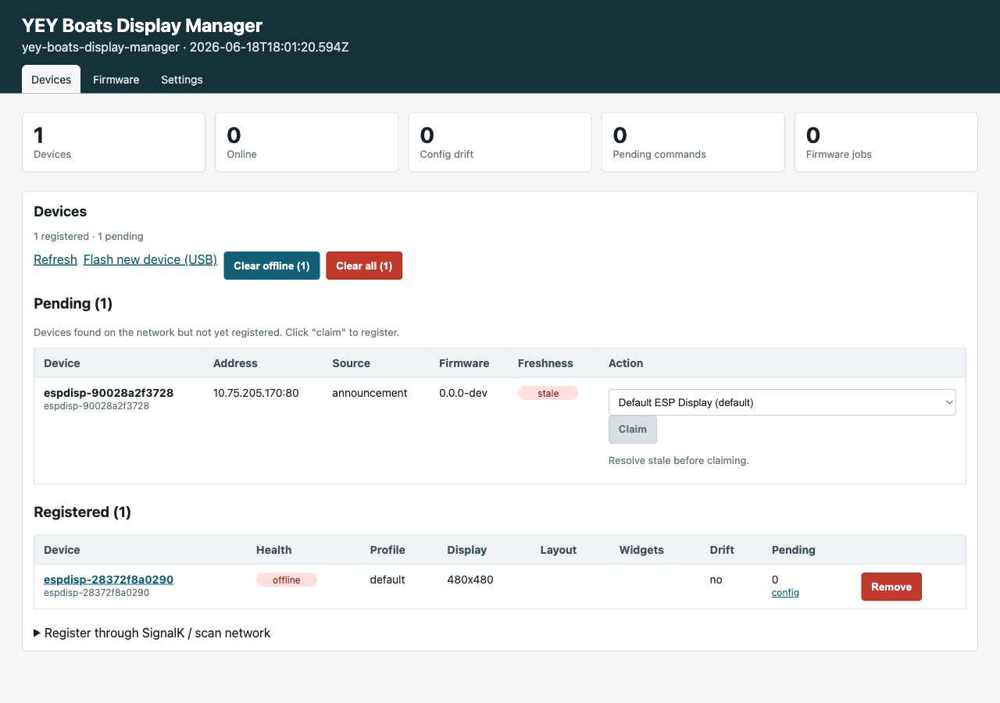
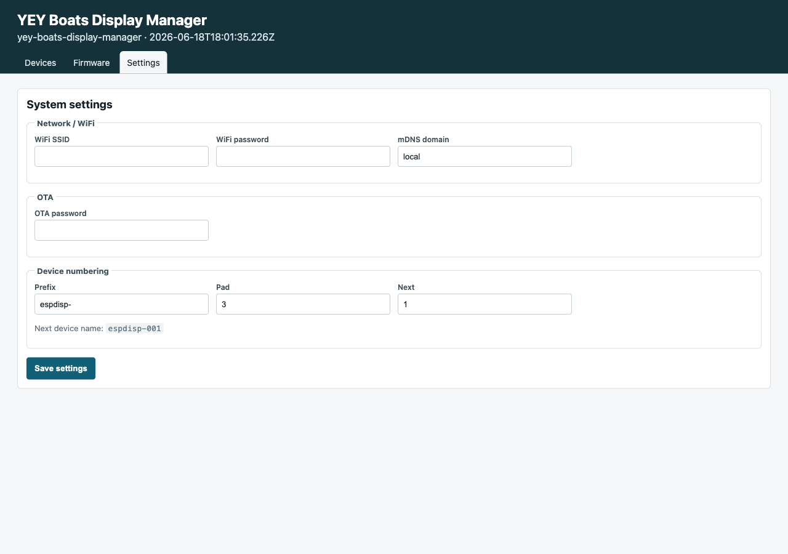
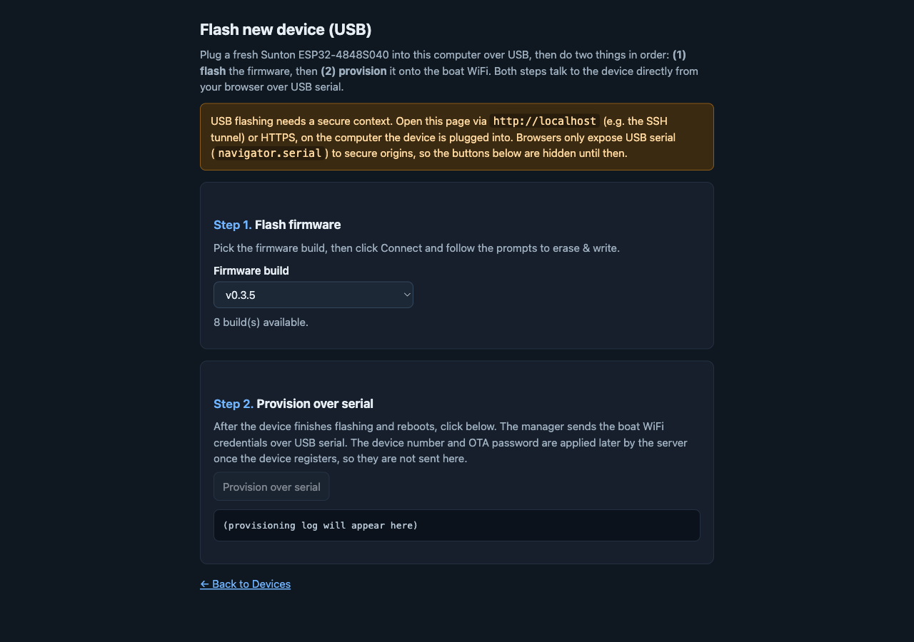
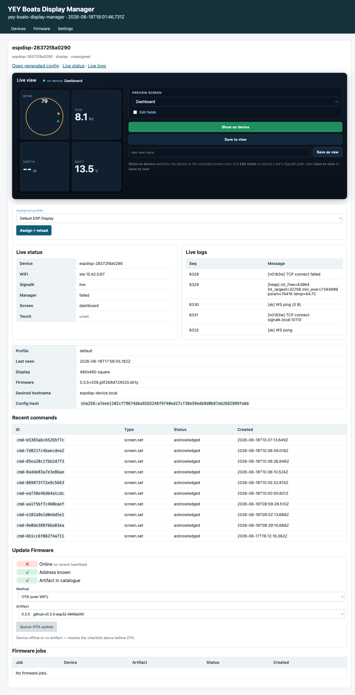

# YEY Boats Display Manager

A [SignalK](https://signalk.org/) server plugin (and embedded webapp) for
managing **YEY Boats marine display devices** — ESP32-S3 multi-function displays
running the [`yey-boats/instruments`](https://github.com/yey-boats/instruments)
firmware. It is the single console for discovering, registering, configuring,
flashing, and OTA-updating every display on the boat.

- **Webapp:** `/yey-boats-display-manager/` (appears in SignalK Admin → Webapps as
  **YEY Boats Display Manager**)
- **Plugin UI:** `/plugins/yey-boats-display-manager/ui`
- **Plugin id:** `yey-boats-display-manager`

> **Renamed from “ESP Display Manager”.** The plugin id, webapp slug, and all
> API routes moved from `espdisp-manager` → `yey-boats-display-manager`. See
> [Upgrading](#upgrading-from-esp-display-manager) for the migration. Device
> wire-protocol identifiers (`.well-known/espdisp-management`,
> `espdisp.management.v1`, the `espdisp-` device-number prefix) are unchanged.

---

## Capabilities

### Devices console
One merged landing page: stat tiles (Devices / Online / Config drift / Pending
commands / Firmware jobs), the **pending-discovery** list (devices seen on the
network but not yet claimed), and the **registered devices** table with working
**Clear offline** / **Clear all** bulk actions. Every action detects an expired
SignalK session and prompts re-login instead of silently failing.



### System settings
Server-held provisioning defaults that are pushed to devices **from the server**
(so a laptop cabled to a device for flashing never has to supply them):

- **Network / WiFi** — SSID, password, mDNS domain relayed to a new device to
  bootstrap it onto the boat network.
- **OTA** — the OTA password. Held server-side, masked, never embedded in a
  firmware image and never sent over the USB cable; delivered only over the
  device’s authenticated config-fetch.
- **Device numbering** — prefix + zero-pad + next-number, so each newly
  provisioned device is auto-named (e.g. `espdisp-001`).



### Flash a new device over USB
Embedded [ESP Web Tools](https://esphome.github.io/esp-web-tools/) flashes a
USB-cabled ESP32-S3 straight from the browser, then bootstraps it onto the
server’s WiFi over a WebSerial console using the firmware’s own text commands.
Gated to secure contexts (open via `http://localhost` or HTTPS on the computer
the device is plugged into).



### Per-device control, live view & firmware updates
Each device page shows a faithful live HUD mirror, live status/logs, the
generated config, the command queue, and an **Update Firmware** panel: pick an
artifact, pick a method (**OTA** server-side job or **Serial / USB** in-browser),
and a connection-validation checklist (online · address known · artifact in
catalogue) blocks the flash until it can succeed.



### Provisioning orchestration
On first registration after a USB flash the manager auto-assigns the next device
number and pushes the OTA password + settings via config-push; the firmware
applies them to NVS and the device becomes controllable and OTA-ready.
Re-registration is idempotent — an already-numbered device is never renumbered.

### Also included
Firmware catalog with GitHub-release import + OTA-job runner; dashboard presets;
the visual layout editor (per-device screen/widget CRUD, manifest-gated);
SignalK + UDP/mDNS/BLE device discovery.

---

## Install

This plugin is distributed from the
[`yey-boats/Instruments-manager`](https://github.com/yey-boats/Instruments-manager)
repository (not the public npm registry). For local/dev or remote SignalK
servers, build a tarball and `npm install` it into the SignalK home, or mount it
as a plugin directory. Full instructions — including the Docker-based lab
deployment — are in [`deploy/README.md`](deploy/README.md).

After install, restart SignalK, then enable **YEY Boats Display Manager** under
SignalK Admin → Server → Plugin Config. Open it at:

```
/plugins/yey-boats-display-manager/ui        (plugin console)
/yey-boats-display-manager/                   (webapp / app-dock tile)
```

## Upgrading from “ESP Display Manager”

The rename changes the plugin id, so SignalK treats it as a new plugin and
stores its config + device registry under a new data directory. To carry your
registered devices across, on the SignalK host:

1. Copy the plugin data dir `plugin-config-data/espdisp-manager/` →
   `plugin-config-data/yey-boats-display-manager/`, and the enable-state file
   `espdisp-manager.json` → `yey-boats-display-manager.json` (do the copy as the
   SignalK user so the files stay writable by the server).
2. Point the plugin dependency / node_modules entry at the new package name and
   restart SignalK.
3. **Reflash each device** (`yey-boats/instruments` ≥ the rebrand commit). The
   firmware self-heals on boot: an auto-generated `espdisp-<mac>` id migrates to
   `yey-d-<mac>`, and a stored manager endpoint carrying the old
   `/plugins/espdisp-manager` base is rewritten to `/plugins/yey-boats-display-manager`
   in place — so the device re-registers under its new id at the new path with no
   manual `manager-endpoint` command. (Operator-set custom device names are kept.)
   The manager then auto-assigns the next `yey-d-NNN` number on first re-register.
4. Update the SignalK **app-dock** tile URL/icon to `/yey-boats-display-manager/`.

## Documentation

- [`deploy/README.md`](deploy/README.md) — install, Docker/lab deployment, API
  route reference.
- [`docs/operator-flash-provision.md`](docs/operator-flash-provision.md) —
  end-to-end operator runbook for flashing + provisioning a fresh device.

## License

© 2026 Yey Boats Project. All rights reserved except as expressly licensed (see [NOTICE](NOTICE)).

Source-available under the [PolyForm Noncommercial License 1.0.0](LICENSE) — free for noncommercial use. **Commercial use requires a separate license** (see [COMMERCIAL.md](COMMERCIAL.md)). Contributions under the [DCO](CONTRIBUTING.md).
